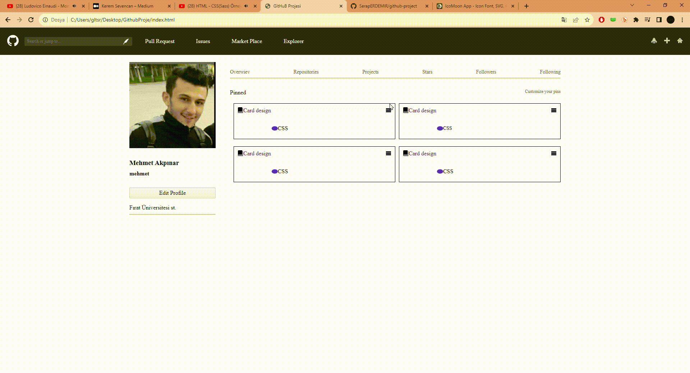

<h1>  Github Arayüz Projesi  </h1>

<h2>Kullanilan Teknolojiler</h2>

-HTML
-HTML5
-CSS
-CSS3

<h4>Default< değerler/h4>

Projemize otomatik olarak gelen  default değerleri kontrol etmek amacıyla normalize ve formalize adında kod  parçaları yerleştirdim .

Değişkenlerimi ise variable olarak olusturduğum dosyada tutuyorum

<h2>İmport</h2>

İmport edilecek dosyalarımı main.scss adındaki dosyama yerleştirdim .Ve oradan tüm değerlerime ulaşmayı amaçladım

Genel itibariye kodlarımı ise content adındaki kod dosyama yerleştirdim

<h1>Proje Gif</h1>

